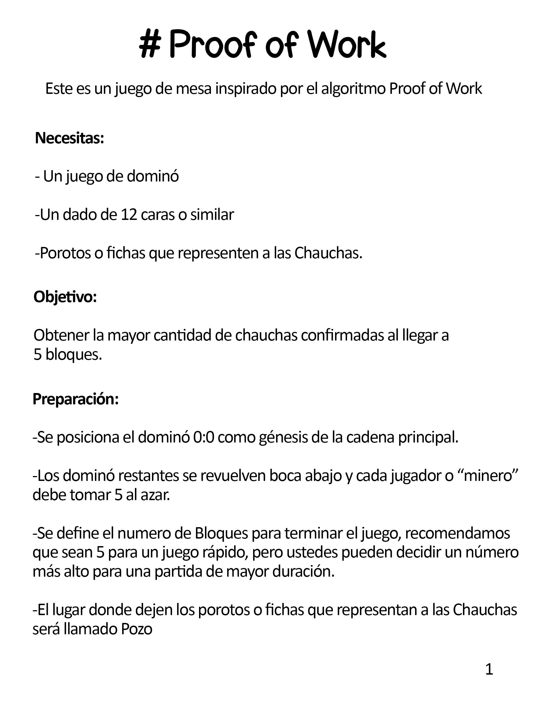
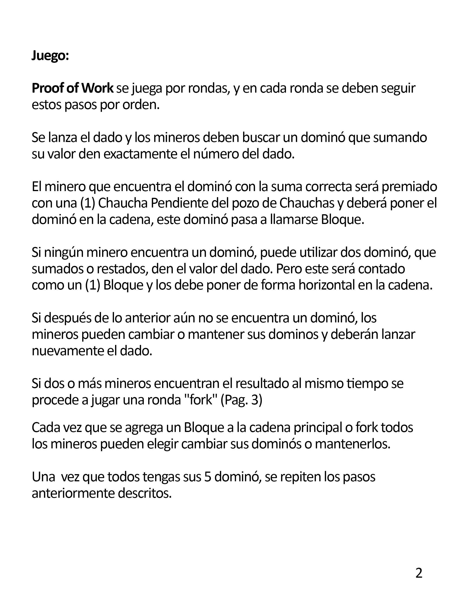
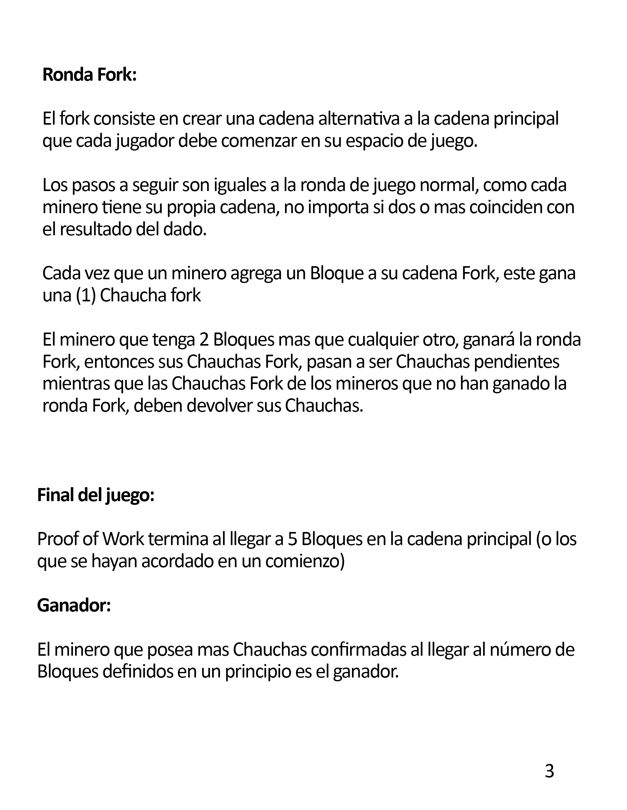

# Proof of Work Game
A Tabletop game with Dominoes a Dice and Beans.

Este es un juego de mesa inspirado por el algoritmo https://en.bitcoin.it/wiki/Proof_of_work[_Proof of Work_].

Para poder comenzar se necesitan un juego de dominó
y un dado de 12 caras o similar. Algunos porotos o fichas
que representen a las chauchas.

El objetivo es obtener la mayor cantidad de chauchas confirmadas al llegar a
5 bloques.

Cada jugador o "minero" debe tener 5 dominós en su mano. Estos son repartidos
aleatoriamente desde una bolsa.

Se posiciona el dominó 0:0 como génesis de la cadena principal.

Se lanza el dado. Los jugadores deben buscar un dominó que sumando
su valor den exactamente el número del dado.

Si ningún jugador encuentra un dominó puede utilizar dos dominó
que sumados o restados den el valor del dado. Pero este será contado
como un bloque. Para esto debe posicionarlo de forma horizontal.

Si después de lo anterior aún no se encuentra un dominó. Los jugadores 
pueden cambiar o mantener 
sus dominos y deberán lanzar nuevamente el dado.

Si solamente un jugador encuentra el resultado. Este será premiado con 1 chaucha
pendiente. Deberá poner el dominó en la cadena.

Si dos o más jugadores encuentran el resultado. Estos deberán hacer un "fork".

El fork consiste en crear una cadena alternativa a la cadena principal.
El fork durará hasta llegar a la cantidad de tres bloques.

Si ocurre un conflicto dentro del fork este deberá continuar hasta que 
se defina claramente quien tenga la cadena más larga.

Cada vez que agrega un bloque al fork de cada jugador. 
Será ganador de 1 Cha Pendientes. 

Cuando se define el ganador de un fork este mantiene sus chauchas pendientes. 
Las chauchas pendientes de todos los demás serán desechadas.

Cada vez que se agrega un bloque a la cadena principal o fork
todos los jugadores pueden elegir cambiar sus dominós o mantenerlos.
Siempre teniendo a 5 en la mano.

El dado se debe utilizar nuevamente.

Este proceso se repite hasta llegar a 5 bloques en la cadena principal.
Si producto de un fork se pasan los 5 bloques. Las chauchas confirmadas 
solo serán hasta llegar al bloque 5 (5 CHA). Los demás bloques 
se pueden mantener si se quiere prolongar el tiempo de juego.

